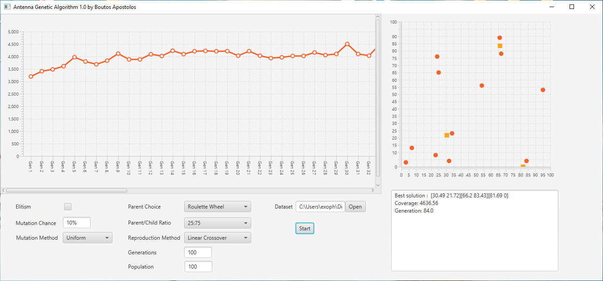

# AntennaGeneticAlgorithm

<b>Antenna Genetic Algorithm</b> is a genetic algorithm implementation, that solves the problem of finding the best possible coordinates
to position three radio antennas in order to provide radio signal coverage to the urban population residing in the given cities
of a 100x100 matrix.

The dataset.xml file contains an <b>N</b> amount of city entries. The position of each city is described by two cartesian coordinates, 
<b>X</b> and <b>Y</b> in the [0,100] scope. Each city also has a certain population that must be serviced.

The amount of the people that an antenna can service is given by the following formula:

c = n * dmax / (20 * d * 0.00001)

Where 
  
  <b>c</b>    is the amount of people the antenna can service. 
  <b>dmax</b> is the maximum euclidean distance between two cities. 
  <b>n</b>    is the city's population. 
  <b>d</b>    is the euclidean distance between the city and the antenna. 

A genetic algorithm is a machine learning algorithm inspired by the evolution of organisms through natural selection. Such an 
algorithm is very useful when we can cheaply produce solutions for a given problem, but we do not know what the best solution is, or finding the best solution through other means is a very resource heavy operation.

The genetic algothm contains the following steps.
<ol>
  <li>Map the solution's parameters (in this case the coordinates of each antenna) into variables called genes.</li>
  <li>Randomly produce a starting population of solutions.</li>
  <li>Evaluate each member of the population via an evaluation function.</li>
  <li>Select a subset of the population as parents. The selection method should be slightly biased to favor members of the
      population with good genes.</li>
  <li>Allow the parents to reproduce, thus creating a new population of solutions called the children population.</li>
  <li>Evaluate all the created children.</li>
  <li>Form the population of the next generation by selecting member from both the parent and the children population. The 
      selection method should be slightly biased to favor members with good genes.</li>
  <li>Go to step 4, until a certain number of generations has been created or the algorithm is stopped.</li>    
</ol>

The project implements the following features:
<ul>
  <li>Parent Selection Methods: Roulette wheel, Ranked Roulette Wheel, Tournament</li>
  <li>Reproduction Methods: Linear Crossover, Arithmetic Crossover</li>
  <li>Mutation Methods: Uniform</li>
  
  
  
 This is a sample screenshot of the project's GUI. The diagram on the left plots the best solution of each generation, while
 the diagram on the right plots the cities and the antennas of the overall best solution on the X,Y matrix
  
  
 
 

